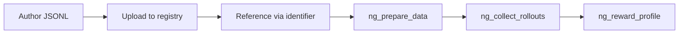

NeMo Gym separates an agentic environment into four components that vary independently. Three of them are servers — agent harness, model, resources. The fourth is the dataset. This page covers what a dataset is, how it flows through the system, and how multi-agent datasets route their rows.

For the field-by-field schema, dataset config object, and the constrained license enum, see [JSONL Schema](/latest/build-environments/data/jsonl-schema). This page is semantic.

## The 4th component

Every shipped environment has a JSONL dataset that drives it. One task per line; each task carries the prompt the agent will see and the metadata the verifier needs. The dataset is peer to the three servers — you can vary it without changing the agent harness, model, or resources server, and the same JSONL line can drive different agents in different runs.

```
Dataset (JSONL: instruction + verifier_metadata)
        |
        v
Agent server (orchestrator)
   /              \
  v                v
Model server   Resources server
                (verify() reads verifier_metadata)
```

## Dataset types

Three types share `DatasetConfig` (`nemo_gym/config_types.py:361`); a fourth has its own config class:

| Type | Purpose | Where it lives | License required |
|---|---|---|---|
| `example` | 5 entries committed to git for fast format checks. | The env's `data/example.jsonl`. | No |
| `train` | Training data for RL. | GitLab dataset registry or Hugging Face Hub. | Yes |
| `validation` | Eval slice during training. | GitLab dataset registry or Hugging Face Hub. | Yes |
| `benchmark` | Curated eval suite under `benchmarks/`. | Separate `BenchmarkDatasetConfig` (`config_types.py:389`) carrying `prepare_script` and `prompt_config`. | — |

The license requirement on `train`/`validation` is enforced by the `check_train_validation_sets` validator (`nemo_gym/config_types.py:381`); it's a constrained `Literal` enum, not a freeform string.

## Storage tiers

Three tiers, with different rules:

- **Git** — `data/example.jsonl` only. The 5-row example file is committed in every shipped resources server. Train and validation files are gitignored under each environment's `data/.gitignore`.
- **GitLab dataset registry** — NVIDIA-internal `train` and `validation`. Pinned by `gitlab_identifier.{dataset_name, version, artifact_fpath}` (`nemo_gym/config_types.py:163`).
- **Hugging Face Hub** — public `train` and `validation`. Pinned by `huggingface_identifier.repo_id` with optional `artifact_fpath` (`nemo_gym/config_types.py:204`).

Both identifiers can coexist on a single `DatasetConfig` — a dataset can be served from either backend depending on the `+data_source` flag at prep time.

## Lifecycle



1. **Author** the JSONL locally. One task per line; minimum is `responses_create_params`. Most envs also include `verifier_metadata`.
2. **Upload** to GitLab via `ng_upload_dataset_to_gitlab` or to Hugging Face via `ng_upload_dataset_to_hf`. Bump the `version` field — registry versions are mutable by convention only.
3. **Reference** in your agent server's YAML config under `datasets:` with `gitlab_identifier` or `huggingface_identifier`.
4. **Prepare** with `ng_prepare_data +mode=train_preparation`. The 4-phase pipeline (`nemo_gym/train_data_utils.py:323-345`) loads the configs, downloads if `+should_download=true`, validates each row, and collates into `<stem>_prepare.jsonl`. During collation, `agent_ref` is stamped onto every row — see below.
5. **Collect rollouts** with `ng_collect_rollouts`, which reads the prepared JSONL and routes each row to its `agent_ref.name`.
6. **Aggregate** with `ng_reward_profile` for per-task pass rates.

## `agent_ref` and multi-agent datasets

`agent_ref` is the row-level field that tells `ng_collect_rollouts` which agent server should own this task. It looks like:

```json
{"agent_ref": {"type": "responses_api_agents", "name": "math_with_judge_simple_agent"}}
```

`ng_prepare_data` stamps it during the collation phase (`nemo_gym/train_data_utils.py:718`), one agent per config in the run. `ng_collect_rollouts` resolves it at request time — `setdefault` semantics (`rollout_collection.py:201`) means a CLI `+agent_name` is only a default for rows that lack their own `agent_ref`, never an override. A row without `agent_ref` and no CLI fallback aborts the run with `ValueError("No agent specified for rows ...")`.

The reason this matters: a single training run can blend tasks from multiple agent harnesses. Math tasks route to `math_with_judge_simple_agent`; code tasks route to `code_gen_simple_agent`; both live in one collated train file and `ng_collect_rollouts` dispatches each row to its owner.

## `verifier_metadata` — the opaque pass-through

The framework treats `verifier_metadata` as opaque — it flows from the JSONL row through the agent into the resources server's `verify()`, which interprets it however the environment needs. Define whatever fields your verifier requires.

```json
{
  "responses_create_params": {"input": [{"role": "user", "content": "What is 15 * 7?"}]},
  "verifier_metadata": {"expected_answer": "105"}
}
```

Some shipped environments hoist task-specific fields to the top level instead of nesting under `verifier_metadata` (`bird_sql`, `mcqa`, etc. — the schema doesn't enforce one shape). For new environments, prefer `verifier_metadata` — the convention is what makes the schema scannable.

## Reproducibility — the materialized-inputs sidecar

`ng_collect_rollouts` writes `<output_stem>_materialized_inputs.jsonl` next to the rollouts file (`rollout_collection.py:131-133, 289-291`). It records the *resolved* prompts that were actually sent — after prompt-config rendering, `+limit` truncation, `+num_repeats` expansion, `task_index`/`rollout_index` assignment, and seed injection. This file is the reproducibility receipt. Together with the YAML config (`+gitlab_identifier.version` pins the source) and the model identity (HF model ID + revision), it names everything needed to re-run a rollout.

`ng_reward_profile` requires this sidecar as input (`reward_profile.py:39-42`).

## Where to next

- [JSONL Schema](/latest/build-environments/data/jsonl-schema) — field-by-field reference for the row shape and `DatasetConfig`.
- [Validate Example Data](/latest/build-environments/data/validate-example-data) — the PR-submission gate using `+mode=example_validation`.
- [Prepare Training Data](/latest/build-environments/data/prepare-train-data) — the train/validation flow with auto-download.
- [Versioning and Provenance](/latest/about/concepts/versioning-provenance) — what's pinned vs. floats across runs.
- [Reward Semantics](/latest/about/concepts/reward-semantics) — what `verify()` does with the row's `verifier_metadata`.
