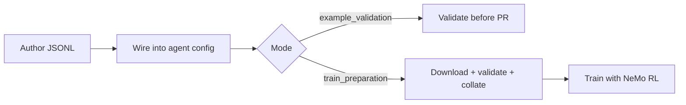

NeMo Gym datasets are JSONL files: one task per line, with `responses_create_params` carrying the prompt and (typically) `verifier_metadata` carrying the data the verifier scores against. This section covers everything you do with data once a resources server exists.

## Pick your path

| If you want to... | Page |
|---|---|
| Look up the row schema, dataset config fields, or license enum | [JSONL Schema](/latest/build-environments/data/jsonl-schema) |
| Validate the 5-entry `data/example.jsonl` before opening a PR | [Validate Example Data](/latest/build-environments/data/validate-example-data) |
| Prepare full `train` / `validation` splits for RL training | [Prepare Training Data](/latest/build-environments/data/prepare-train-data) |
| Pull a dataset from Hugging Face Hub | [Download from Hugging Face](/latest/build-environments/data/download-huggingface) |
| Apply YAML prompt templates at rollout time | [Prompt Config](/latest/build-environments/data/prompt-config) |

## Where datasets live

Three storage tiers with different rules:

- **Git** — `data/example.jsonl` only. The 5-row example file is committed to git in every shipped resources server. Train and validation files are gitignored under each environment's `data/.gitignore`.
- **GitLab dataset registry** — NVIDIA-internal `train` and `validation`. Pinned by `gitlab_identifier.{dataset_name, version, artifact_fpath}` on the dataset config.
- **Hugging Face Hub** — public `train` and `validation`. Pinned by `huggingface_identifier.repo_id` (with optional `artifact_fpath`).

`ng_prepare_data +should_download=true` fetches from the configured registry. `+data_source` selects between `huggingface` (default) and `gitlab`. See [Prepare Training Data](/latest/build-environments/data/prepare-train-data) for the full flow.

## Dataset types at a glance

| Type | Purpose | Lives in |
|---|---|---|
| `example` | 5 entries for fast format checks | git |
| `train` | RL training data | GitLab or Hugging Face |
| `validation` | Eval slice during training | GitLab or Hugging Face |
| `benchmark` | Curated eval suite (under `benchmarks/`) | git, with separate `BenchmarkDatasetConfig` |

For the field-by-field schema, dataset config object, and the constrained license enum, see [JSONL Schema](/latest/build-environments/data/jsonl-schema).

## Workflow

## CLI commands

| Command | Purpose |
|---|---|
| `ng_prepare_data` | Validate + generate metrics + collate. See [CLI: Data](/api/cli/data). |
| `ng_download_dataset_from_hf` | Fetch a single artifact from Hugging Face Hub. |
| `ng_download_dataset_from_gitlab` | Fetch a single artifact from the GitLab registry. |
| `ng_upload_dataset_to_hf` / `ng_upload_dataset_to_gitlab` | Publish a JSONL to a registry. |

## Performance notes

- Row validation streams line-by-line; memory footprint stays flat regardless of file size.
- Validation is single-threaded; datasets above ~100k rows take minutes.
- Use `num_repeats` on the dataset config rather than physically duplicating rows in the JSONL — it's cheaper and the metrics math still works out.
