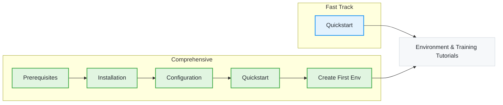

NeMo Gym is **a Gymnasium for LLMs** — RL training environments with a familiar `reset()` / `step()` API. This section gets you from zero to a scored rollout, then to a custom environment of your own.

<Tip>
Already installed and have an API key? Jump straight to the [Quickstart](/latest/get-started/quickstart).
</Tip>

## Prerequisites

Before you start, identify your use case and confirm you meet the requirements below.

**Who are these guides for?**

| Audience | Use Cases |
| --- | --- |
| AI/ML engineers and researchers | Run existing benchmarks, evaluate models, prototype new environments |
| Environment authors | Wrap a benchmark or task as a NeMo Gym environment for training and eval |
| Training engineers | Generate scored rollouts at scale for RL training (NeMo RL, Unsloth, and other frameworks) |

**What you need (complete in order):**

1. Python 3.12+ on a [verified configuration](/latest/get-started/prerequisites#verified-configurations).
2. An OpenAI-compatible inference endpoint and API key.
3. Familiarity with the command line and basic Python.

## Choose Your Path

Select the guide that matches your experience level and goals.

<Cards>

<Card title="Prerequisites" href="/latest/get-started/prerequisites">
Detailed system requirements, verified configurations, and pre-installation checklist.

<Badge minimal outlined>requirements</Badge>
</Card>

<Card title="Installation" href="/latest/get-started/installation">
Three install paths — Source, PyPI, or Container — plus verification and troubleshooting.

<Badge minimal outlined>install</Badge>
</Card>

<Card title="Configuration" href="/latest/get-started/configuration">
Set up `env.yaml` with your model credentials before running anything.

<Badge minimal outlined>env.yaml</Badge>
</Card>

<Card title="Quickstart" href="/latest/get-started/quickstart">
Run an end-to-end rollout against the Blackjack environment and read the win rate.

<Badge intent="success" minimal outlined>start here</Badge> <Badge minimal outlined>10 min</Badge>
</Card>

<Card title="Create Your First Environment" href="/latest/get-started/create-first-environment">
Build your first environment by subclassing `GymnasiumServer` in 25 lines.

<Badge minimal outlined>build your own</Badge> <Badge minimal outlined>15 min</Badge>
</Card>

</Cards>

## Suggested Learning Path

If you are new to NeMo Gym, follow one of these recommended sequences.

**Choose your path:**

- **Fast Track**: Quickstart → Tutorials. Skim if you have NeMo Gym installed and credentials configured already.
- **Comprehensive**: Prerequisites → Installation → Configuration → Quickstart → Create Your First Environment → Tutorials. Best for first-time users or production planning.
